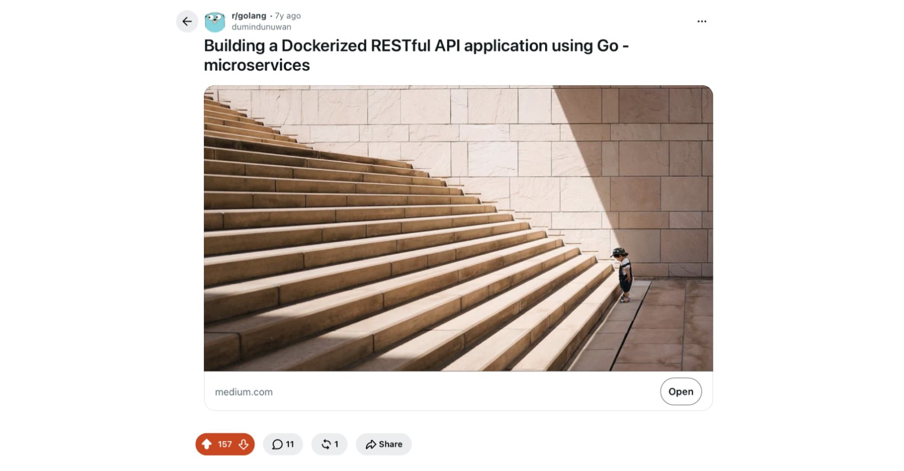

## 2026: January 19

> 
> - [Reddit: r/golang](https://www.reddit.com/r/golang/comments/1qh06ok/i_recently_hit_1000_github_stars_on/).

## 2019: October 07

> 
> - [Medium](https://medium.com/learning-cloud-native-go/lets-get-it-started-dc4634ef03b).
> - [Reddit: r/golang](https://www.reddit.com/r/golang/comments/deam7y/building_a_dockerized_restful_api_application/).